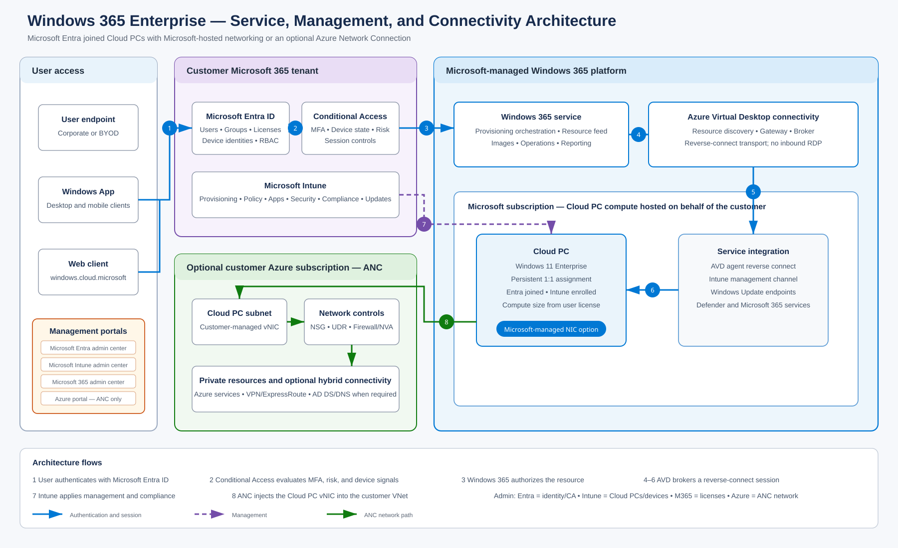

# Windows 365 Enterprise: design, deployment, and operations

A practical Windows 365 engineering guide. Start with a small pilot, record what happens, and use the same checks before a wider rollout. The repository separates Business lab observations from Enterprise procedures that still need live validation.

## Start here

| Step | What you will decide or verify | Guide |
|---|---|---|
| 1. Prepare | License, tenant roles, pilot users, and success criteria | [Tenant readiness](use-cases/UC-01-tenant-readiness-and-pilot-design.md) |
| 2. Choose a network | Microsoft-hosted network or Azure network connection; Entra join or hybrid join | [Network decision](use-cases/UC-03-network-architecture.md) |
| 3. Provision | User group, license, image, policy, and Cloud PC state | [Enterprise provisioning](use-cases/UC-02-enterprise-provisioning.md) |
| 4. Manage | Enrollment, configuration, apps, security, updates, and access | [Management path](#management-path) |
| 5. Operate | Support, lifecycle actions, user changes, and rollout | [Operations path](#operations-path) |

**Evidence status:** Earlier Business lab work covered Intune enrollment, Edge and desktop settings, Company Portal, and creation of an update ring and compliance policy. No screenshots or logs from that lab are published here, so those observations cannot yet be independently verified. Enterprise provisioning, Azure network connection, resize, move, restore, and reprovision are documented as designs and procedures; this repository does not yet show completed Enterprise tests. See the [evidence index](evidence/README.md) before treating any procedure as a tested result.

## Architecture decision

| Option | Use when | Customer network work |
|---|---|---|
| Microsoft-hosted network + Microsoft Entra join | Cloud PCs mainly use internet, Microsoft 365, and SaaS apps; a separately tested VPN or private access client may reach private apps | No customer Azure network connection or subscription required for Cloud PC networking |
| Azure network connection + Microsoft Entra join | Cloud PCs need customer-controlled routing, private access, or egress | Plan VNet, subnet capacity, DNS, outbound access, and connection health |
| Azure network connection + hybrid join | AD DS device join is a firm application or policy requirement | Add domain-controller reachability, DNS, join permissions, and identity synchronization |

Choose one network option for each provisioning policy. The Cloud PC runs in the Windows 365 service; with an Azure network connection its virtual network interface attaches to the customer VNet. The Azure network connection does not place the Cloud PC VM in the customer's subscription. [Microsoft's deployment options](https://learn.microsoft.com/windows-365/enterprise/deployment-options) and [Azure network connection overview](https://learn.microsoft.com/windows-365/enterprise/azure-network-connections) explain the boundaries.

## Deployment path

1. [UC-01: tenant readiness and pilot](use-cases/UC-01-tenant-readiness-and-pilot-design.md) — define scope, roles, licenses, and acceptance checks.
2. [UC-03: network architecture](use-cases/UC-03-network-architecture.md) — make the network and join decision before creating a provisioning policy.
3. [UC-13: image and application baseline](use-cases/UC-13-image-and-application-baseline.md) — decide whether a gallery image meets the persona before building a custom image.
4. [UC-02: Enterprise provisioning](use-cases/UC-02-enterprise-provisioning.md) — select image and network, assign a user group, monitor the first Cloud PC, and record evidence.
5. [UC-04: Intune enrollment and inventory](use-cases/UC-04-intune-enrollment-and-inventory.md) — confirm device records and check-in before assigning more controls.

## Management path

| Order | Guide | Result to capture |
|---|---|---|
| 1 | [UC-05: configuration](use-cases/UC-05-configuration-management.md) | Assignment and setting on the Cloud PC |
| 2 | [UC-07: applications](use-cases/UC-07-application-lifecycle.md) | Install state, detection, and uninstall result |
| 3 | [UC-08: Windows servicing](use-cases/UC-08-windows-servicing.md) | Ring settings, update state, and restart behavior |
| 4 | [UC-06: security and compliance](use-cases/UC-06-endpoint-security-and-compliance.md) | Policy result, device state, and failed checks |
| 5 | [UC-14: local admin and LAPS](use-cases/UC-14-local-admin-laps-and-security-baseline.md) | Local group membership and password rotation test |
| 6 | [UC-09: Conditional Access](use-cases/UC-09-conditional-access.md) | Report-only outcome, sign-in logs, and exclusions |

## Operations path

1. [UC-12: monitoring and troubleshooting](use-cases/UC-12-monitoring-and-troubleshooting.md) — establish a support baseline and capture diagnostic facts.
2. [UC-10: lifecycle actions](use-cases/UC-10-cloud-pc-lifecycle-operations.md) — test restart, resize, move, restore, and reprovision with a pilot.
3. [UC-11: joiner, mover, and leaver](use-cases/UC-11-joiner-mover-leaver.md) — handle group, license, and Cloud PC changes together.
4. [UC-15: production rollout](use-cases/UC-15-production-rollout-cost-and-continuity.md) — define personas, rollout rings, support ownership, cost checks, and continuity tests.

## Diagrams

Each diagram has an editable draw.io source and SVG/PNG export. The network variants are separate so the Microsoft-hosted option is not mistaken for a customer VNet deployment.

| Diagram | Editable source | Preview |
|---|---|---|
| Enterprise overview | [draw.io](architecture/diagrams/source/01-windows365-enterprise-high-level.drawio) | [SVG](architecture/diagrams/exported/01-windows365-enterprise-high-level.svg) |
| Microsoft-hosted network | [draw.io](architecture/diagrams/source/02-microsoft-hosted-network.drawio) | [SVG](architecture/diagrams/exported/02-microsoft-hosted-network.svg) |
| Entra join with Azure network connection | [draw.io](architecture/diagrams/source/03-entra-join-azure-network-connection.drawio) | [SVG](architecture/diagrams/exported/03-entra-join-azure-network-connection.svg) |
| Hybrid join with Azure network connection | [draw.io](architecture/diagrams/source/04-hybrid-join-azure-network-connection.drawio) | [SVG](architecture/diagrams/exported/04-hybrid-join-azure-network-connection.svg) |
| Sign-in and Conditional Access | [draw.io](architecture/diagrams/source/05-identity-sso-conditional-access.drawio) | [SVG](architecture/diagrams/exported/05-identity-sso-conditional-access.svg) |
| Intune policy delivery | [draw.io](architecture/diagrams/source/06-intune-management-policy-delivery.drawio) | [SVG](architecture/diagrams/exported/06-intune-management-policy-delivery.svg) |
| Provisioning lifecycle | [draw.io](architecture/diagrams/source/07-provisioning-lifecycle.drawio) | [SVG](architecture/diagrams/exported/07-provisioning-lifecycle.svg) |
| Apps and updates | [draw.io](architecture/diagrams/source/08-application-update-delivery.drawio) | [SVG](architecture/diagrams/exported/08-application-update-delivery.svg) |
| User lifecycle | [draw.io](architecture/diagrams/source/09-joiner-mover-leaver-lifecycle.drawio) | [SVG](architecture/diagrams/exported/09-joiner-mover-leaver-lifecycle.svg) |
| Cloud PC actions | [draw.io](architecture/diagrams/source/10-cloud-pc-lifecycle-operations.drawio) | [SVG](architecture/diagrams/exported/10-cloud-pc-lifecycle-operations.svg) |

## Evidence and review

Start with the [technical review path and Enterprise pilot gates](docs/review-path.md). It identifies the design to inspect and the results still needed before a full Enterprise claim.

The [coverage matrix](docs/completeness-matrix.md) tells you where a procedure is documented. It is not a test report. Use the [evidence index](evidence/README.md) to see what can be independently checked. Add screenshots only after removing tenant names, user details, addresses, and device identifiers. The [architecture decisions](docs/architecture-decisions.md) and [diagram review standard](architecture/diagram-review.md) capture the reasoning behind the designs.

Run `bash scripts/validation/validate-repository.sh` to check diagram sources and exports, required sections, local links, evidence claims, and common publication mistakes. This is a repository check; it does not validate a tenant or prove a lab result.

## Microsoft documentation

- [Windows 365 Enterprise documentation](https://learn.microsoft.com/windows-365/enterprise/)
- [Windows 365 requirements](https://learn.microsoft.com/windows-365/enterprise/requirements)
- [Networking deployment options](https://learn.microsoft.com/windows-365/enterprise/deployment-options)
- [Create a provisioning policy](https://learn.microsoft.com/windows-365/enterprise/create-provisioning-policy)
- [Conditional Access for Windows 365](https://learn.microsoft.com/windows-365/enterprise/set-conditional-access-policies)

This is an independent engineering project. Verify portal steps against current Microsoft documentation before a production change. Original text and code use the repository MIT license; Microsoft architecture icons remain subject to [Microsoft’s icon terms](architecture/icons/README.md).
