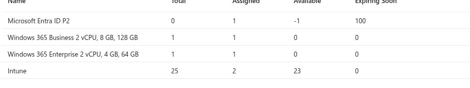

# Enterprise pilot capacity, network, and image inventory

Date (UTC): 2026-09-24  
Method: Read-only Microsoft Entra license products and Microsoft Intune provisioning inventory. No license, policy, network, or image was created or changed.

## UC-01: License inventory

Entra **Licenses > All products** showed **Windows 365 Enterprise 2 vCPU / 4 GB / 64 GB: 1 total, 1 assigned, 0 available**. Windows 365 Business 2 vCPU / 8 GB / 128 GB also showed 1 total, 1 assigned, 0 available. Intune showed 25 total, 2 assigned, 23 available. Microsoft Entra ID P2 showed 0 total, 1 assigned, -1 available and an expiring-soon figure of 100. The P2 row is anomalous and needs a product-level entitlement review before a licensed P2-dependent test is claimed. This view does not itself identify the Enterprise assignee or confirm all service plans and roles.

**Capacity result:** No unassigned Enterprise seat is available for a second disposable Cloud PC. The existing assigned Cloud PC may contain user data and is not designated disposable. Reusing its seat by removing its license would start a lifecycle change, so no license was moved.

## UC-03: Azure network connection inventory

Intune **Devices > Provision Cloud PCs > Azure network connection** showed **No Azure network connections yet** and 0 items loaded. The one visible Enterprise provisioning policy uses a gallery image and has no ANC in its row. This supports the inventory result only. No VNet, subnet, DNS, health check, hybrid join, or private-app path has been tested. An ANC test requires a prepared Azure network and a Cloud PC pilot assigned to an ANC policy.

## UC-13: Image inventory

Intune **Devices > Provision Cloud PCs > Custom images** showed **No custom images yet** and 0 items loaded. The current Enterprise policy listed **Windows 11 Enterprise + Microsoft 365 Apps 25H2**, image status **Supported**, and was assigned. This confirms gallery-image selection in the existing policy; it does not validate custom image preparation, import, versioning, or provisioning from a new image.

## Next complete tests

1. Verify the Enterprise assignee, role assignments, and isolated pilot-group membership without publishing identity details.
2. Obtain a separately licensed disposable Enterprise pilot or an explicit data migration and recovery plan for the existing machine before fresh provisioning, resize, restore, or reprovision tests. The current inventory has 0 free Enterprise seats.
3. Prepare a customer VNet, subnet, DNS, permissions, and test application; create an ANC, confirm health, and provision a dedicated pilot with that ANC. Hybrid join additionally requires an AD DS environment.
4. Build and import a custom image only for a defined persona requirement, then provision and validate a separate pilot. The gallery path can be tested without creating a custom image.

All four are prerequisites and future test steps, not completed results. This record establishes the actual tenant capacity and absence of ANC/custom-image resources at inspection time.
