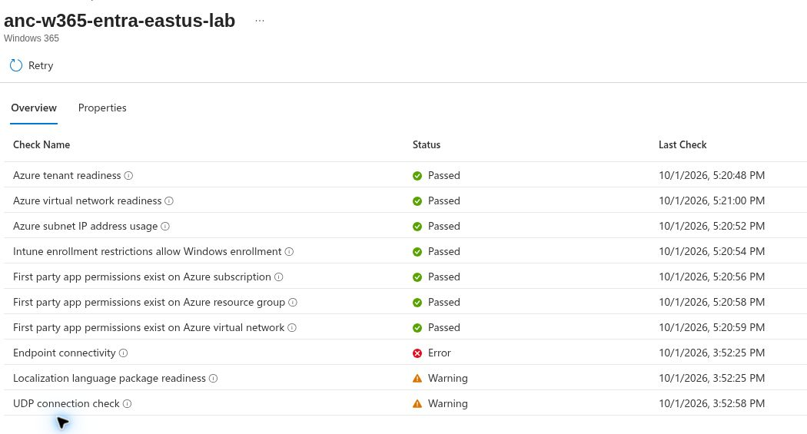

# UC-03: Azure network connection health review

**Observed:** 2026-10-01 in the live Intune and Azure portals. **Result: Failed.** This record covers an existing Microsoft Entra Join Azure network connection; it is not a Cloud PC move or a successful provisioning test.

## Scope and method

Opened **Intune > Devices > Provision Cloud PCs > Azure network connection**, selected `anc-w365-entra-eastus-lab`, and reviewed its health checks. In Azure, inspected `rg-w365-anc-lab`, `vnet-w365-anc-eastus-lab`, and `snet-cloudpcs` without changing their settings. The connection list showed **Checks failed**, **0 Cloud PCs**, East US, and 251 available IP addresses.

The screenshot displays the portal's local time; this record does not infer a UTC offset from it.

| Health check | Observed result |
|---|---|
| Azure tenant readiness | Passed |
| Azure virtual network readiness | Passed |
| Azure subnet IP address usage | Passed |
| Intune enrollment restrictions allow Windows enrollment | Passed |
| First-party app permissions on subscription | Passed |
| First-party app permissions on resource group | Passed |
| First-party app permissions on virtual network | Passed |
| Endpoint connectivity | **Error**: the detail says a required Windows 365 URL could not be contacted during provisioning; it did not list a specific failed URL in the inspected view. |
| Localization language package readiness | **Warning**: language package URLs could not be contacted; non-US English settings might fail. |
| UDP connection check | **Warning**: an unknown error occurred while determining UDP connectivity. This does not establish that UDP traffic was blocked. |

## Azure network observation

The resource group listed two virtual networks, one in East US and one in Central US. It did not list a NAT gateway or public IP. The East US VNet uses `10.88.10.0/24` and Azure-provided DNS. Its `snet-cloudpcs` subnet uses `10.88.10.0/24`, showed 251 available addresses, and had **private subnet enabled**, **NAT gateway None**, **network security group None**, and **route table None**. The private subnet has no default outbound access. No change was submitted in Azure or Intune during this review.

**Assessment:** The absent explicit outbound path is a plausible cause of the endpoint and language-package results. The portal result alone does not prove which URL failed or whether any other control also contributed. The UDP warning is inconclusive. A same-subnet connectivity test and a successful rerun of all ANC checks are needed before this connection can be called healthy.

## Next controlled test

1. Within a newly approved Azure cost and time window, configure a supported explicit outbound path for this private subnet. Record its resource IDs, estimated cost, and cleanup plan.
2. Check the required Windows 365 endpoints, DNS resolution, and UDP connectivity from the intended subnet. Record actual endpoint-level failures and effective routes.
3. Retry ANC health checks and publish the new dated status. Remove temporary paid egress resources after the lab.
4. Keep the existing Microsoft-hosted Cloud PC on its current policy. Consider a move only after ANC health passes and a maintenance, data recovery, and restoration plan is approved.

No temporary NAT gateway or public IP remained in the inspected resource group at the end of this review. Resources outside that group were not audited. Device-side routing, a Cloud PC move, and a healthy ANC result remain untested.

## References

- [Azure network connections](https://learn.microsoft.com/windows-365/enterprise/azure-network-connections)
- [Windows 365 network requirements](https://learn.microsoft.com/windows-365/enterprise/requirements-network)
- [Azure NAT Gateway design](https://learn.microsoft.com/azure/nat-gateway/nat-gateway-design)
