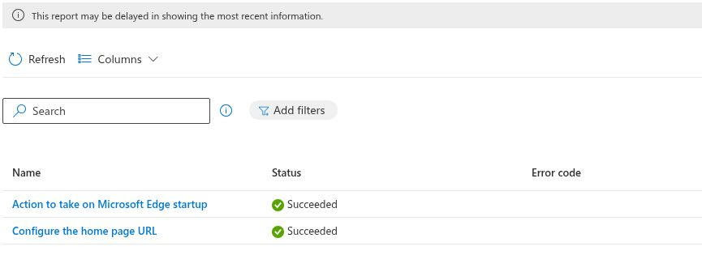
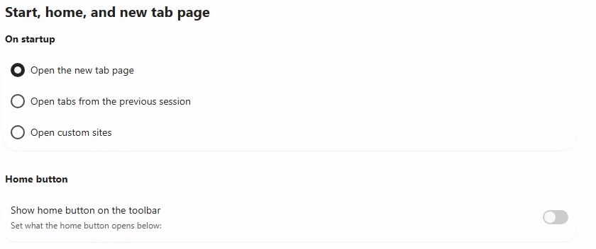

# Enterprise pilot: device check-in, Edge, and security follow-up

Date (UTC): 2026-09-24  
Scope: assigned Windows 365 Enterprise Cloud PC; other managed device excluded  
Method: signed-in Intune device report and assigned-user Windows App web desktop; screenshots cropped at capture time to exclude identity

## UC-04: managed device

The Intune All devices grid showed two records for the pilot account. The **Corporate** Cloud PC record matching the Enterprise 2 vCPU/4 GB/64 GB model was **Compliant**, build **10.0.26200.9457**, with grid last check-in **09/24/2026 07:53 PM**. Its device Overview showed **09/24/2026 12:53 PM** for last check-in. The two portal views display different time-zone conventions; neither is labeled UTC in this record. The second **Personal** device record had an older check-in and was excluded from Enterprise conclusions. This establishes a later device check-in than the previous inspection, but it does not establish that the earlier administrator-triggered Sync action completed or that every policy report refreshed.

## UC-05: Edge configuration comparison

The assigned Cloud PC's Intune configuration report listed seven **Succeeded** entries, including an Edge Settings Catalog profile. The Edge per-setting report showed **Action to take on Microsoft Edge startup: Succeeded** and **Configure the home page URL: Succeeded**, with the portal warning that report data may be delayed.

On the connected Enterprise desktop, Edge first-run customization was completed. Under **Settings > Start, home, and new tab page**, **Open the new tab page** was selected for startup, and **Show home button on the toolbar** appeared off. The settings screen does not expose the configured home page URL here. The portal result and device screen have not been reconciled to the profile's intended values. `edge://policy` and an actual home-button navigation were not captured. Do not call the Edge lab passed on these two screenshots alone.

## UC-06: security follow-up

The connected device's [Windows Security record](UC-06-2026-09-24-device-security-check.md) now includes the exact potentially unwanted app blocking control: On, with Block downloads checked and an administrator-managed message. The app and browser tile's warning had cleared. The Intune device Overview still showed two compliance policies Compliant, but the **Windows 365 - Compliance** policy row last-contacted value remained **08/30/2026 06:23 AM**, despite the newer device check-in. Treat the older per-policy timestamp as an unresolved reporting or freshness question, not proof of a current six-rule evaluation.

## Outcome and next checks

| Lab | Outcome | Next proof |
|---|---|---|
| Device inventory | Confirmed current Enterprise device and later check-in | Enrollment trace and check-in time-zone normalization |
| Edge profile | Portal settings succeeded; device settings observed; effective-policy match unresolved | Profile intended values, `edge://policy`, home-button behavior |
| Security | PUA control state verified on device; compliance report stale | Fresh per-policy result and exact policy source |

No restart, restore, reprovision, resize, license reassignment, or destructive action was performed in this follow-up.
