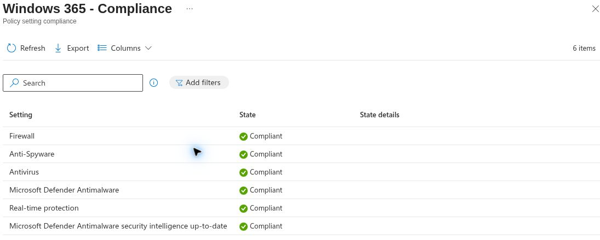
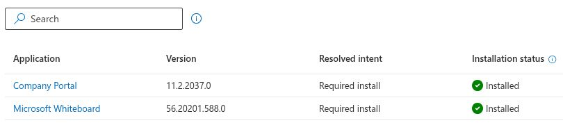
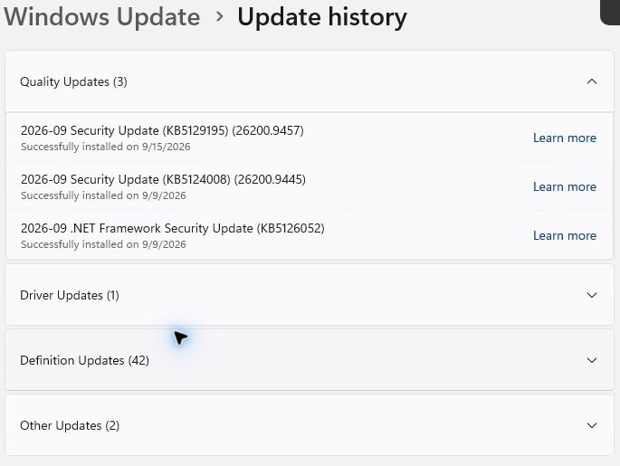

# Enterprise pilot: security, apps, updates, and restore inventory

Date (UTC): 2026-09-24  
Edition: Windows 365 Enterprise, existing dedicated pilot Cloud PC  
Scope: one pilot Cloud PC; account, tenant, and device identifiers excluded

This record combines read-only portal views with one Windows Settings check on the connected Enterprise desktop. It does not claim that a new policy was deployed or a restore action was executed during this review.

## UC-06: compliance and security

The Intune **Windows 365 - Compliance** policy listed six settings as **Compliant**: Firewall, Anti-Spyware, Antivirus, Microsoft Defender Antimalware, real-time protection, and Defender security intelligence up-to-date. The policy list showed a last-contacted timestamp from **2026-08-30** for this policy; the device Overview showed a later check-in on **2026-09-24**. This is a portal compliance result, not a fresh device-side Defender/Firewall command result. No BitLocker state or LAPS password was inspected.

## UC-07: managed applications

The Intune **All apps > Managed apps** view showed **Company Portal 11.2.2037.0** and **Microsoft Whiteboard 56.20201.588.0**, both with **Required install** intent and **Installed** status for the pilot Cloud PC. This supports the required-install reporting path. Available assignment, user launch, detection rules, and Uninstall were not tested.

## UC-08: Windows servicing

On the connected Enterprise desktop, Windows Settings showed **You're up to date** and a check performed that day. The **Get the latest updates as soon as they're available** control was unavailable under organization policy. Update history listed **KB5129195** (build **26200.9457**, installed **2026-09-15**), **KB5124008** (build **26200.9445**, installed **2026-09-09**), and **KB5126052** (.NET security update, installed **2026-09-09**). The installed build matches the separately recorded `cmd /c ver` output in the [pilot session check](UC-02-2026-09-24-portal-check.md). This does not prove a newly deployed ring caused those installations or that a restart deadline worked.

## UC-10: restore inventory

The Intune device **Restore points** page contained automatic restore points, including one dated **2026-09-24**. This proves that restore points were listed at inspection time. No restore was started; user data, downtime, and post-restore behavior were not tested.

## Result and next actions

| Use case | Observation | Still required for a full test |
|---|---|---|
| UC-06 | Six Intune compliance settings reported Compliant | Current device-side security state and policy freshness; BitLocker and LAPS separately |
| UC-07 | Two Required apps reported Installed | Launch confirmation, Available assignment, controlled Uninstall, and detection review |
| UC-08 | Update history and current build visible on Cloud PC | Before/after ring assignment, update delivery, restart deadline and reporting comparison |
| UC-10 | Automatic restore points listed | Approved restore on a disposable pilot, user-data checkpoint, and post-action verification |

Keep each observation separate from the unperformed tests. The screenshots were cropped at capture time to omit user email, device name, serial number, tenant ID, and subscription details.
