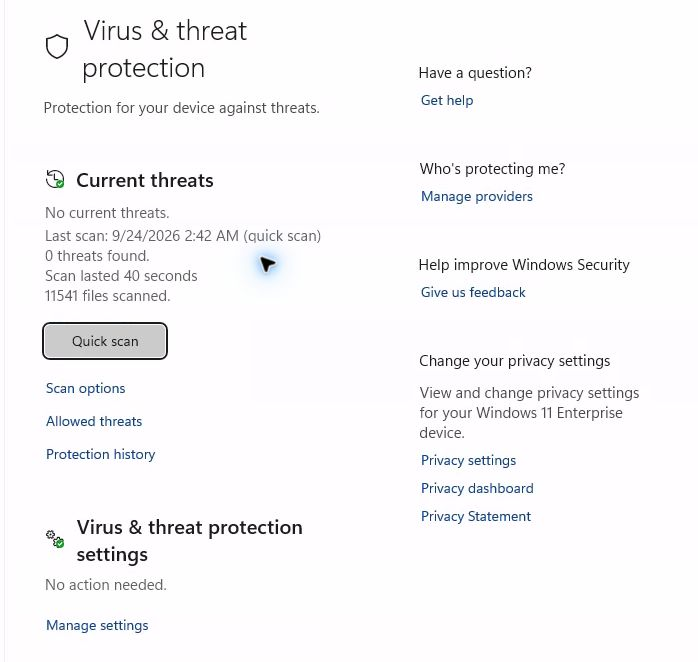
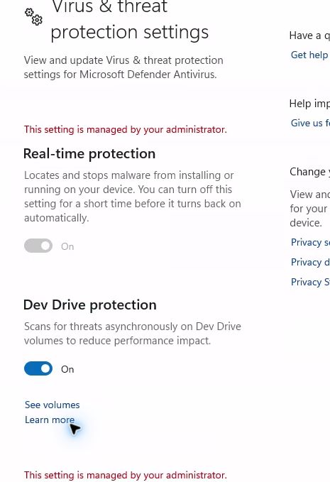
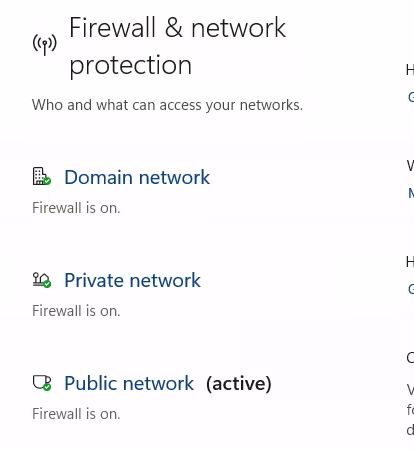
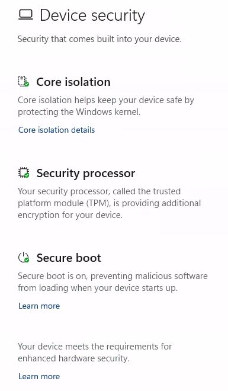

# UC-06: Connected Enterprise Cloud PC security check

Date (UTC): 2026-09-24, approximately 19:00  
Scope: the assigned Windows 365 Enterprise Cloud PC, connected through Windows App web  
Method: read-only Windows Settings and Windows Security pages. No protection setting was changed.

## Device-side observations

- Windows Settings **Privacy & security > Windows Security** showed **Firewall & network protection: No actions needed**, **Device security: No actions needed**, and **Virus & threat protection: Actions recommended**. **App & browser control** also showed **Actions recommended**. The latter two warnings were not resolved or diagnosed in this check.
- Windows Security **Virus & threat protection** showed **No current threats**, a quick scan dated **2026-09-24 02:42** with **0 threats found**, 40 seconds and 11,541 files scanned. Its settings section showed **No action needed**. This screenshot does not explain the separate overview warning.
- Windows Security **Virus & threat protection settings** displayed **Real-time protection: On**, with the switch disabled and **This setting is managed by your administrator**. This is a current device-side observation, not proof of which particular Intune setting produced it.
- Windows Security **Firewall & network protection** displayed **Firewall is on** for Domain, Private, and Public profiles. Public was labeled **active**. The presence of a Domain profile in that UI does not mean the Entra-joined Cloud PC is domain-joined.
- Windows Security **Device security** listed a security processor (TPM) and **Secure boot is on**. The page said the device meets the requirements for enhanced hardware security. BitLocker conversion state and recovery-key handling were not checked.

## Interpretation and remaining checks

The [Intune compliance rule report](UC-06-07-08-10-2026-09-24-pilot-check.md) had six Compliant values but its policy last-contacted date was 2026-08-30. These device-side screens now corroborate current real-time protection and firewall on the connected machine. They do not establish current policy-report freshness, which profile applied which setting, or the cause of the Windows Security overview recommendations. A full UC-06 pass still needs a fresh Intune policy check-in, per-setting source, relevant Defender/Firewall command output if remote keyboard input works, and an explicit BitLocker/recovery decision. No negative test was run on this assigned Cloud PC.
