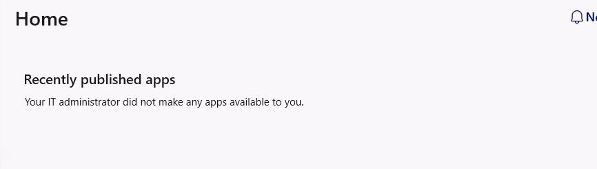
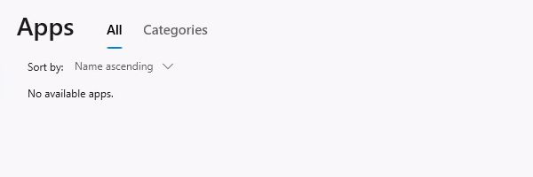
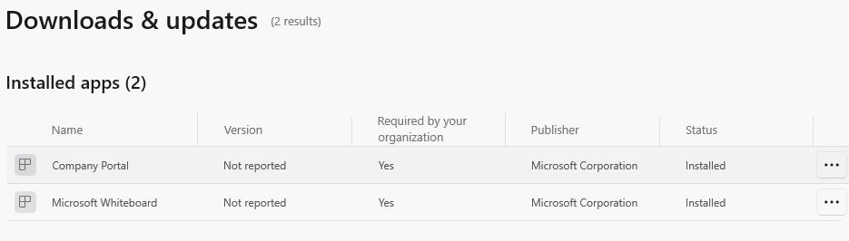

# UC-07: Company Portal on the Enterprise Cloud PC

Date (UTC): 2026-09-24  
Scope: signed-in assigned user on the existing Windows 365 Enterprise Cloud PC  
Method: Windows App web session; Company Portal launched from the Cloud PC Start app list; read-only Home, Apps and Downloads & updates views

## Observed result

- Company Portal opened and displayed its Home page. This establishes a user-side launch, beyond the earlier [Intune installed report](UC-06-07-08-10-2026-09-24-pilot-check.md).
- Home said the administrator had not made any apps available to this user. The **Apps > All** catalog showed **No available apps**. This is the observed current user experience, not evidence of a failed Available assignment; no suitable assignment was inspected or created in this check.
- **Downloads & updates > Installed apps** listed **Company Portal** and **Microsoft Whiteboard**, both **Required by your organization: Yes** and **Installed**. This is a user-side list that corroborates the earlier Intune Required-install report. Version was **Not reported** in this view.
- The Whiteboard row's options offered **Reinstall** and **Share**, not a verified app launch. Whiteboard's own opening screen, detection rules, Available delivery and controlled Uninstall remain untested.

## Conclusion

**Partial lab result.** Company Portal launch and the device/user-side Required-app listing were verified. The Available and Uninstall paths need separate scoped tests. No app was installed, reinstalled, removed, or assigned in this check.

## Enterprise device follow-up: 2026-10-07 Pacific time

Connected to the same Enterprise Cloud PC with Windows App web client. Windows Start search found **Microsoft Whiteboard** as an app. Selecting **Open** launched its desktop application and showed its Home screen with a **New Whiteboard** tile. A banner at the top said: "Unable to save - may be a temporary error or you don't have a license. If you already have OneDrive for Business, please try again later or contact your administrator for additional support."

The application also displayed a notice that its standalone app would be retired on 2026-10-16, pointing users to the web or Microsoft Teams. This is the notice shown in the app on the observation date, not an independently verified service announcement.

**Result:** Required installation and application launch were observed, but usable board creation and persistence were **not** demonstrated. The banner alone does not prove whether the cause is a missing service plan, OneDrive provisioning, a transient service error, or another condition. Check the pilot user's applicable license and OneDrive availability, then create a disposable board and confirm it persists before calling this app operational. No board was created or data changed during this check.
