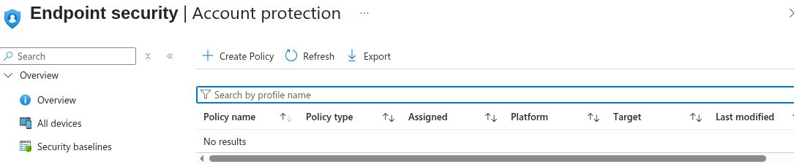

# UC-14: Account Protection policy inventory

Date (UTC): 2026-09-24  
Scope: signed-in Intune tenant; Endpoint security > Account protection inventory  
Method: read-only policy list; no local administrator password or recovery secret opened

The Account protection policy list displayed **No results** with no profile-name filter entered. No Account protection policy was available on this page to inspect for Windows LAPS or local group membership. This does not establish that LAPS is absent from every possible management path or that a local account has any particular privilege on the Cloud PC. No LAPS rotation, password retrieval, or local group test was performed.

**Outcome: inventory only.** A complete lab needs a scoped policy and assignment, a safe local Administrators membership check, policy report, protected rotation event, and a review of recovery access without publishing any password.
